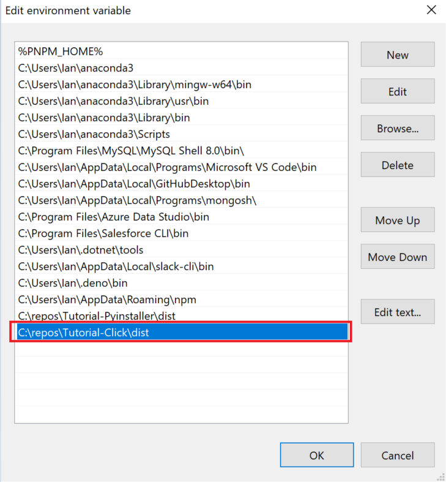
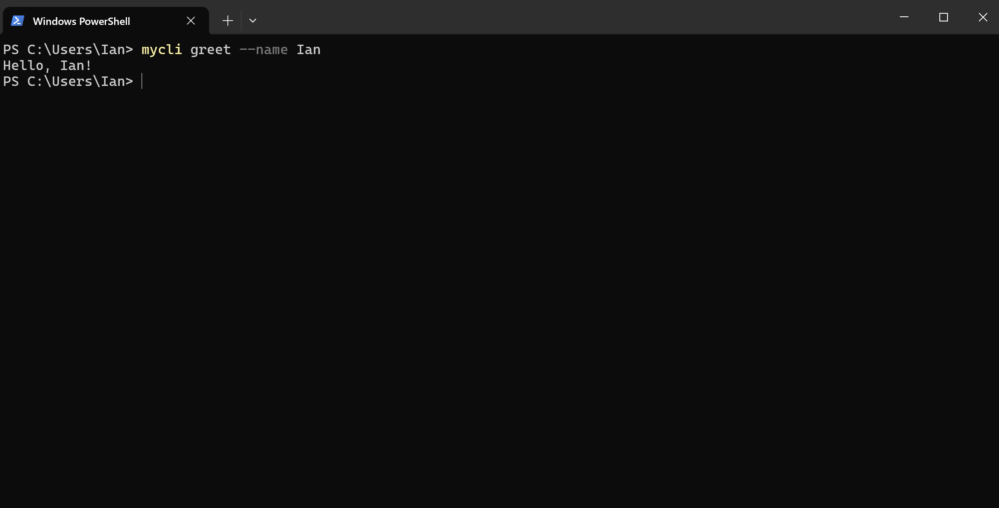

A small repo dedicated to desigining a CLI tool with Python via Click and built by the Pyinstaller module.
For details, see:

- [Click](https://click.palletsprojects.com/en/stable/)
- [Pyinstaller docs](https://pyinstaller.org/en/stable/)

### Instructions
1. `pip install pyinstaller`
2. `pip install click`
2. `pyinstaller --onefile mycli.py`
3. (Optional) Run the following command: `./dist/mycli --help`
4. (Optional) Test the following command: `./dist/mycli greet --name Ian`
5. Add the `/dist` folder containing `mycli.exe` to your path variable (Windows):
    
6. Open a new terminal window
7. Run the following command(s):

    To execute the `greet` command with the `name` parameter:
    `mycli greet --name Ian`
    

    To execute the `return_pokemon` command with the `pokemon` parameter:
    `mycli return_pokemon --pokemon lapras`


### Testing

To test Click apps, [you need a runner](https://click.palletsprojects.com/en/stable/testing/).

For simplicity the `runner.py` is located at the root of the directory.

To run the `runner.py` file to test the click cli, run the following command:

```bash
python runner.py
```